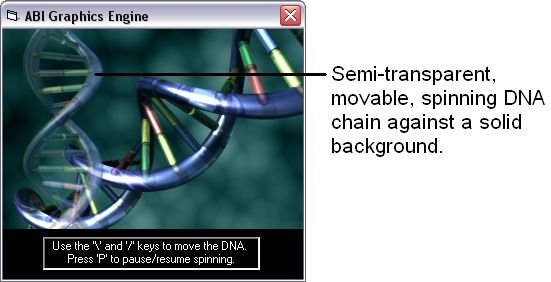



## Alpha\-Blend\-Image Graphics Engine

### Description

The Alpha-Blend-Image graphics engine allows you to draw pictures to the screen with variable transparency (see screenshot), and if done correctly, can reduce aliasing so much that it isn't visible. It also prevents graphical glitches, such as flickering, by using a buffer. The engine works particularly well for 2D games, such as the one I am working on now (screenshots included in zip file).
 
### More Info
 

             |
---                |---
**Submitted On**   |2004-08-25 22:43:04
**By**             |[Craig Bonathan](https://github.com/Planet-Source-Code/PSCIndex/blob/master/ByAuthor/craig-bonathan.md)
**Level**          |Advanced
**User Rating**    |4.7 (33 globes from 7 users)
**Compatibility**  |VB 6\.0
**Category**       |[Graphics](https://github.com/Planet-Source-Code/PSCIndex/blob/master/ByCategory/graphics__1-46.md)
**World**          |[Visual Basic](https://github.com/Planet-Source-Code/PSCIndex/blob/master/ByWorld/visual-basic.md)
**Archive File**   |[Alpha\-Blen179138992004\.zip](https://github.com/Planet-Source-Code/craig-bonathan-alpha-blend-image-graphics-engine__1-56080/archive/master.zip)

